Political Spending by Scientists
================
Wim Janssen
16-1-2022

**Table of Contents:**

  - Introduction
  - Import dependencies
  - Import data
  - Check missing values
  - Negative transaction amounts
  - Main plots on political spending by cycle
  - Political spending by cycle and party
  - Donation frequencies by amount category
  - The two spikes
  - More unique individuals or more frequent contributors
  - Multiple donations to the same committee or across committees
  - Bundled donations
  - Transaction dates for multiple donations to the same committee
  - Conclusion

## Introduction

Do scientists give political donations to politics in the US? Yes they
do\! One might think that scientists should do their work independently,
and that abstaining from political involvement might be the best thing
to do. However, scientists apparently do have their political
preferences and give political donations to politicians, just like other
occupation groups. In this project I explore political donations by
scientists (excluding social scientists) and engineers in the US.
Fivethirtyeight has explored this as well and came to the conclusion
that the majority of the donors spend their money on Democrats. See
[here](https://fivethirtyeight.com/features/when-scientists-donate-to-politicians-its-usually-to-democrats/)
for the article and see
[here](https://github.com/fivethirtyeight/data/tree/master/science-giving)
for the data.

In the descriptive analysis I first plot the political donations by
scientists and engineers in general for each election cycle. For the
2016 election cycle, I find an interesting phenomenon, which the article
of Fivethirtyeight didn’t mention: the total amount spent by scientists
is of similar magnitude in total as before, but the donation amount per
individual is much lower and the total number of donations is much
higher. This is especcially true for contributions to Democrats.

In this project I am going to explore more about this change in spending
behavior of scientists. This is interesting as it raises several
questions. For instance, are there more scientists contributing, or are
there just more smaller donations per scientist? And if the latter is
true, do scientists spend their multiple donations on multiple
committees, or to the same committee? And if the latter is true, do
scientists bundle their transactions on the same date, or do they
contribute on different dates to the same committee?

This project is mainly descriptive. That is, I am not trying to explain
what causes the observed patterns in spending behavior. One important
cause that might trigger the observed patterns in the 2016 election
cycle is a change in legislation. I am currently not aware of any new
legislation in the 2016 cycle that prohibits large donations. This would
also not be consistent with the data, as there are still some very large
donations.

Let’s start importing the dependencies and the
    data\!

## Import dependencies

``` r
library(tidyverse)
```

    ## -- Attaching packages ---------------------------------------------------------------------------------------------------------- tidyverse 1.2.1 --

    ## v ggplot2 3.2.1     v purrr   0.3.2
    ## v tibble  2.1.3     v dplyr   0.8.3
    ## v tidyr   1.0.0     v stringr 1.4.0
    ## v readr   1.3.1     v forcats 0.4.0

    ## -- Conflicts ------------------------------------------------------------------------------------------------------------- tidyverse_conflicts() --
    ## x dplyr::filter() masks stats::filter()
    ## x dplyr::lag()    masks stats::lag()

``` r
library(lubridate)
```

    ## 
    ## Attaching package: 'lubridate'

    ## The following object is masked from 'package:base':
    ## 
    ##     date

## Import data

``` r
data <- read_csv("D:/Projects/Science_federal_giving/science_federal_giving.csv")
```

    ## Parsed with column specification:
    ## cols(
    ##   .default = col_character(),
    ##   transaction_tp = col_number(),
    ##   zip_code = col_double(),
    ##   transaction_dt = col_double(),
    ##   cycle = col_double(),
    ##   transaction_amt = col_double(),
    ##   `2016_dollars` = col_double(),
    ##   file_num = col_double(),
    ##   sub_id = col_double()
    ## )

    ## See spec(...) for full column specifications.

    ## Warning: 36 parsing failures.
    ##   row      col               expected actual                                                            file
    ## 28463 zip_code no trailing characters      T 'D:/Projects/Science_federal_giving/science_federal_giving.csv'
    ## 30790 zip_code no trailing characters      T 'D:/Projects/Science_federal_giving/science_federal_giving.csv'
    ## 30791 zip_code no trailing characters      T 'D:/Projects/Science_federal_giving/science_federal_giving.csv'
    ## 30827 zip_code no trailing characters      T 'D:/Projects/Science_federal_giving/science_federal_giving.csv'
    ## 30828 zip_code no trailing characters      T 'D:/Projects/Science_federal_giving/science_federal_giving.csv'
    ## ..... ........ ...................... ...... ...............................................................
    ## See problems(...) for more details.

``` r
head(data, 10)
```

    ## # A tibble: 10 x 31
    ##    cmte_nm cmte_id cmte_tp cmte_pty cand_name cand_pty_affili~
    ##    <chr>   <chr>   <chr>   <chr>    <chr>     <chr>           
    ##  1 AMERIC~ C00501~ S       REP      DURANT, ~ REP             
    ##  2 A LOT ~ C00017~ H       DEM      OBEY, DA~ DEM             
    ##  3 A WHOL~ C00374~ H       DEM      GRIJALVA~ DEM             
    ##  4 A WHOL~ C00374~ H       DEM      GRIJALVA~ DEM             
    ##  5 A WHOL~ C00374~ H       DEM      GRIJALVA~ DEM             
    ##  6 A WHOL~ C00374~ H       DEM      GRIJALVA~ DEM             
    ##  7 A WHOL~ C00374~ H       DEM      GRIJALVA~ DEM             
    ##  8 A WHOL~ C00374~ H       DEM      GRIJALVA~ DEM             
    ##  9 ABEL M~ C00493~ H       REP      MALDONAD~ REP             
    ## 10 ABERCR~ C00247~ H       DEM      ABERCROM~ DEM             
    ## # ... with 25 more variables: cand_office_st <chr>, cand_office <chr>,
    ## #   cand_office_district <chr>, cand_status <chr>, rpt_tp <chr>,
    ## #   transaction_pgi <chr>, transaction_tp <dbl>, entity_tp <chr>,
    ## #   cleaned_name <chr>, city <chr>, state <chr>, zip_code <dbl>,
    ## #   employer <chr>, cleanedoccupation <chr>, classification <chr>,
    ## #   transaction_dt <dbl>, cycle <dbl>, transaction_amt <dbl>,
    ## #   `2016_dollars` <dbl>, other_id <chr>, tran_id <chr>, file_num <dbl>,
    ## #   memo_cd <chr>, memo_text <chr>, sub_id <dbl>

The dataset has 881793 rows.

``` r
data %>%
  map_df(class)
```

    ## # A tibble: 1 x 31
    ##   cmte_nm cmte_id cmte_tp cmte_pty cand_name cand_pty_affili~
    ##   <chr>   <chr>   <chr>   <chr>    <chr>     <chr>           
    ## 1 charac~ charac~ charac~ charact~ character character       
    ## # ... with 25 more variables: cand_office_st <chr>, cand_office <chr>,
    ## #   cand_office_district <chr>, cand_status <chr>, rpt_tp <chr>,
    ## #   transaction_pgi <chr>, transaction_tp <chr>, entity_tp <chr>,
    ## #   cleaned_name <chr>, city <chr>, state <chr>, zip_code <chr>,
    ## #   employer <chr>, cleanedoccupation <chr>, classification <chr>,
    ## #   transaction_dt <chr>, cycle <chr>, transaction_amt <chr>,
    ## #   `2016_dollars` <chr>, other_id <chr>, tran_id <chr>, file_num <chr>,
    ## #   memo_cd <chr>, memo_text <chr>, sub_id <chr>

``` r
data <- data %>%
  mutate(cycle=as.character(cycle))
```

## Check missing values

In this section I am going to do some analysis on the missing values in
the dataset. This is important as we need to understand which variables
and which rows are unusable.

``` r
missing_data <- is.na(data)
missing_data <- as_tibble(missing_data)

missing_data %>%
  map_dbl(function(x) round(mean(x),7))
```

    ##              cmte_nm              cmte_id              cmte_tp 
    ##            0.4667649            0.4667649            0.4667649 
    ##             cmte_pty            cand_name cand_pty_affiliation 
    ##            0.4667649            0.5647493            0.4667694 
    ##       cand_office_st          cand_office cand_office_district 
    ##            0.4667649            0.4667649            0.4668080 
    ##          cand_status               rpt_tp      transaction_pgi 
    ##            0.4668601            0.4667649            0.5118174 
    ##       transaction_tp            entity_tp         cleaned_name 
    ##            0.4667649            0.4668170            0.4667944 
    ##                 city                state             zip_code 
    ##            0.4668533            0.4675134            0.4674419 
    ##             employer    cleanedoccupation       classification 
    ##            0.4679828            0.4667649            0.4667649 
    ##       transaction_dt                cycle      transaction_amt 
    ##            0.4667728            0.4667728            0.4667649 
    ##         2016_dollars             other_id              tran_id 
    ##            0.4667978            0.8884432            0.4667649 
    ##             file_num              memo_cd            memo_text 
    ##            0.4667649            0.9962100            0.7911415 
    ##               sub_id 
    ##            0.4667649

A substantial part of the observations has missing values for all
variables. We should delete those observations. But first, let us
examine some of rows with missing values.

``` r
missing_data %>%
  filter(cmte_id) %>%
  map_dbl(mean)
```

    ##              cmte_nm              cmte_id              cmte_tp 
    ##                    1                    1                    1 
    ##             cmte_pty            cand_name cand_pty_affiliation 
    ##                    1                    1                    1 
    ##       cand_office_st          cand_office cand_office_district 
    ##                    1                    1                    1 
    ##          cand_status               rpt_tp      transaction_pgi 
    ##                    1                    1                    1 
    ##       transaction_tp            entity_tp         cleaned_name 
    ##                    1                    1                    1 
    ##                 city                state             zip_code 
    ##                    1                    1                    1 
    ##             employer    cleanedoccupation       classification 
    ##                    1                    1                    1 
    ##       transaction_dt                cycle      transaction_amt 
    ##                    1                    1                    1 
    ##         2016_dollars             other_id              tran_id 
    ##                    1                    1                    1 
    ##             file_num              memo_cd            memo_text 
    ##                    1                    1                    1 
    ##               sub_id 
    ##                    1

Indeed, for all variables the values are missing. We can safely delete
observations with missing values on cmte\_id:

``` r
data <- data %>%
  filter(!is.na(cmte_id))
```

The dataset now has 470203 rows. Let us now examine the missing values
of the transactions that have no missing cmte\_id:

``` r
missing_data <- is.na(data)
missing_data <- as_tibble(missing_data)
missing_data %>%
  map_dbl(function(x) round(mean(x),7))
```

    ##              cmte_nm              cmte_id              cmte_tp 
    ##            0.0000000            0.0000000            0.0000000 
    ##             cmte_pty            cand_name cand_pty_affiliation 
    ##            0.0000000            0.1837547            0.0000085 
    ##       cand_office_st          cand_office cand_office_district 
    ##            0.0000000            0.0000000            0.0000808 
    ##          cand_status               rpt_tp      transaction_pgi 
    ##            0.0001786            0.0000000            0.0844890 
    ##       transaction_tp            entity_tp         cleaned_name 
    ##            0.0000000            0.0000978            0.0000553 
    ##                 city                state             zip_code 
    ##            0.0001659            0.0014036            0.0012697 
    ##             employer    cleanedoccupation       classification 
    ##            0.0022841            0.0000000            0.0000000 
    ##       transaction_dt                cycle      transaction_amt 
    ##            0.0000149            0.0000149            0.0000000 
    ##         2016_dollars             other_id              tran_id 
    ##            0.0000617            0.7907925            0.0000000 
    ##             file_num              memo_cd            memo_text 
    ##            0.0000000            0.9928924            0.6083181 
    ##               sub_id 
    ##            0.0000000

Soms variables have a lot of substantial missing values, however, they
seem to be irrelevant for subsequent analysis. We delete these variable
from the dataset.

``` r
data <- data %>%
  select(-other_id, -memo_cd, -memo_text)
```

Finally, let us check whether missing values between the variables are
correlated

``` r
missing_data <- is.na(data)
missing_data <- as_tibble(missing_data)
mean_missing_data <- map(missing_data, mean)
missing_data_variables <- colnames(missing_data)[mean_missing_data > 0] # select only the variables with missing values
correlation_matrix <- missing_data %>%
  select(missing_data_variables) %>%
  cor() %>%
  round(5)

correlation_matrix_transformer <- function(cormatrix, threshold){
  # this function creates a display of correlations higher than the threshold
  variable1 <- c()
  variable2 <- c()
  correlation <- c()
  for (row in 1:dim(cormatrix)[1]){
    for (column in 1:dim(cormatrix)[2]){
      if (row < column){ # select only the upper-right part correlations of the correlation matrix
        variable1 <- c(variable1, rownames(cormatrix)[row])
        variable2 <- c(variable2, colnames(cormatrix)[column])
        correlation <- c(correlation, cormatrix[row,column])
      }
    }
  }
  flattened_cor_tibble <- tibble(variable1, variable2, correlation) # create a tibble with two variable names and the correlation between them
  flattened_cor_tibble %>%
    mutate(abs_correlation = abs(correlation)) %>%
    filter(abs_correlation > threshold) %>% # select the strong correlations
    arrange(desc(abs_correlation)) %>%
    select(-abs_correlation)
}

correlation_matrix_transformer(correlation_matrix, threshold=0.05)
```

    ## # A tibble: 8 x 3
    ##   variable1      variable2       correlation
    ##   <chr>          <chr>                 <dbl>
    ## 1 transaction_dt cycle                 1    
    ## 2 entity_tp      cleaned_name          0.752
    ## 3 cand_name      transaction_pgi       0.635
    ## 4 state          zip_code              0.598
    ## 5 transaction_dt 2016_dollars          0.491
    ## 6 cycle          2016_dollars          0.491
    ## 7 city           zip_code              0.264
    ## 8 city           state                 0.251

A lot of these correlations make sense.

  - If the transaction date is not known, then also the election cycle
    is not known, and as a result transaction amounts cannot be adjusted
    for inflation (2016\_dollars). The mean of missing values is quite
    low (see previous table).
  - If entity type is missing, then also contributer name
    (cleaned\_name) is missing. The mean of missing values (see previous
    table) is quite low.
  - Also missing address variables are correlated (state, city,
    zipcode). But missing address variables are not correlated with
    missing non-address variables.
  - Missing Candidate name and transaction contribution codes are
    related. The mean of missing values (see previous table) is quite
    high. These seem to be important.

For our subsequent analysis, the transaction date and the cycle are
quite important. Therefore, observations that have missing values for
these variables are deleted from the dataset.

``` r
data <- data %>%
  filter(!is.na(transaction_dt))
```

As we are interested in the election cycles 2008, 2010, 2012, 2014 and
2016, we delete observations that belong to the 2006 cycle. These are
also very small in number.

``` r
data <- data %>%
  filter(cycle!=2006)
```

## Negative transaction amounts

Some transaction amounts in the dataset are negative. These might be
returned contributions or data errors. As our interest is in the
intitial contribution made by contributors, observations with negative
contribution amounts are going to be deleted. But first, let us see how
prevalant these contributions are.

``` r
data_negative <- data %>%
  mutate(sign_amount = if_else(transaction_amt < 0, "positive", "negative")) %>%
  group_by(cycle, sign_amount) %>%
  summarise(total_amount = sum(transaction_amt)/1000000)
  
ggplot(data=data_negative, aes(x=cycle, y=total_amount, fill=sign_amount)) +
  geom_bar(stat="Identity") +
  labs(title="Total amount of political donations by scientists", x="cycle", y="total amount in millions", fill="sign") +
  theme(plot.title = element_text(hjust = 0.5))
```

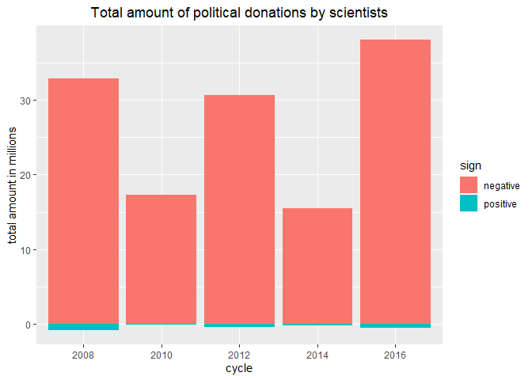<!-- -->

As you can see, donations with negative amounts are very small in
number. We can safely delete these observations from the data.

``` r
data <- data %>%
  filter(transaction_amt > 0)
```

## Main plots on political spending by cycle

This section shows the main plots about political spending by scienties
per election cycle. First we plot the total amount of donations by
scientists per election cycle.

``` r
summary_by_cycle <- data %>%
  group_by(cycle) %>%
  summarise(total_amount = sum(transaction_amt) / 1000000,
            mean_amount = mean(transaction_amt),
            number_transactions = n() / 1000
            )

ggplot(data=summary_by_cycle, aes(x=cycle, y=total_amount)) +
  geom_bar(stat="Identity", fill="darkgrey") +
  labs(title="Total amount of political donations by scientists", x="cycle", y="total amount in millions") +
  theme(plot.title = element_text(hjust = 0.5))
```

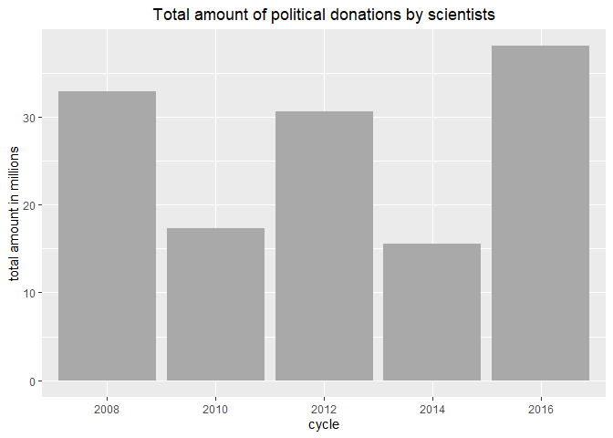<!-- -->

Next, we are interested in the average amount that scientists spend per
election cycle

``` r
ggplot(data=summary_by_cycle, aes(x=cycle, y=mean_amount)) +
  geom_bar(stat="Identity", fill="darkgrey") +
  labs(title="Average amount of political donations by scientists", x="cycle", y="average amount in dollars") +
  theme(plot.title = element_text(hjust = 0.5))
```

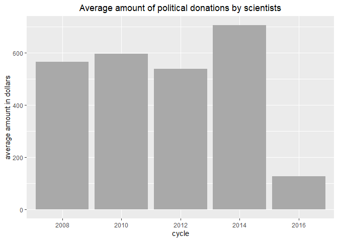<!-- -->

Finally, we plot the number of transactions that scientists have per
election cycle.

``` r
ggplot(data=summary_by_cycle, aes(x=cycle, y=number_transactions)) +
  geom_bar(stat="Identity", fill="darkgrey") +
  labs(title="Number of political donations by scientists", x="cycle", y="number of transactions in thousands") +
  theme(plot.title = element_text(hjust = 0.5))
```

<!-- -->

These plots provide us with one important insight. In the 2016 election
cycle, spending behavior by scientists is very different from the other
cycles. The total spending is slightly more than in other presidential
election cycles, but what is striking is that scientists on average
spend much less compared to before, and that the total number of
transactions is much higher. In the remainder of this project, I am
going to delve deeper into the spending behaviour of scientists in the
2016 cycle.

Let us see another type of plot to see more detailed when the number of
transactions begins to increase.

``` r
data <- data %>%
  mutate(transaction_date = mdy(transaction_dt), # compute date variables
         transaction_year = year(transaction_date),
         transaction_month = month(transaction_date),
         transaction_yearmonth = make_date(transaction_year, transaction_month, 01)
         )
```

``` r
data %>%
  group_by(transaction_yearmonth) %>%
  summarise(freq=n()) %>%
  ggplot(aes(x=transaction_yearmonth, y=freq)) +
  geom_line() +
  labs(title="Number of monthly transactions", "x=time", y="frequency by month") +
  theme(plot.title = element_text(hjust = 0.5))
```

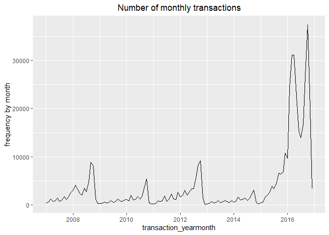<!-- -->

In the plot above we see a similar pattern. In the 2016 cycle the
frequency of transactions is much higher compared with the other
cycles\! Please note the two spikes in the 2016 cycle. We will see later
what is going on here.

## Political spending by cycle and party

In this section, we build on the main plots by splitting the statistics
for the two largest political parties in the US, the Democrats and the
Republicans.

``` r
data <- data %>%
  mutate(committee_party = if_else(cmte_pty=="DEM"|cmte_pty=="Dem"|cmte_pty=="dem"|cmte_pty=="D", "Democrats", if_else(cmte_pty=="REP"|cmte_pty=="Rep"|cmte_pty=="rep"|cmte_pty=="R", "Republicans", if_else(cmte_pty=="NULL", "unknown", "other"))) # compute committee party variable
  )
```

Let’s plot the total spending amount of scientists by cycle and party.

``` r
summary_by_cycle_party <- data %>%
  filter(committee_party=="Democrats"|committee_party=="Republicans") %>%
  group_by(committee_party, cycle) %>%
  summarise(total_amount = sum(transaction_amt) / 1000000,
            mean_amount = mean(transaction_amt),
            number_transactions = n() / 1000
            )

ggplot(data=summary_by_cycle_party, aes(x=cycle, y=total_amount, fill=committee_party)) +
  geom_bar(position="dodge", stat="Identity") +
  labs(title="Total spending by party", x="cycle", y="total amount in millions", fill="committee party") +
  theme(plot.title = element_text(hjust = 0.5))
```

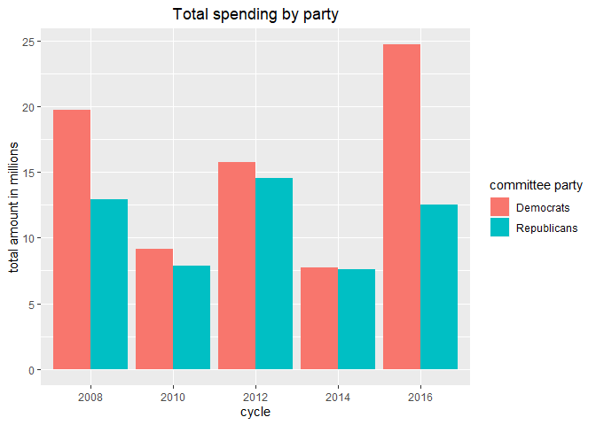<!-- -->

Let’s now plot the donation’s average amount by cycle and
party.

``` r
ggplot(data=summary_by_cycle_party, aes(x=cycle, y=mean_amount, fill=committee_party)) +
  geom_bar(position="dodge", stat="Identity") +
  labs(title="Average spending by party", x="cycle", y="average amount in dollars", fill="committee party") +
  theme(plot.title = element_text(hjust = 0.5))
```

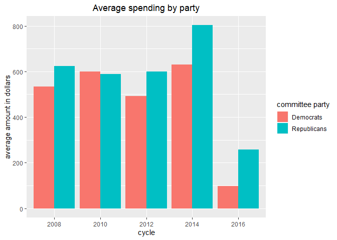<!-- -->

Now, let’s plot the total number of donations by cycle and
party.

``` r
ggplot(data=summary_by_cycle_party, aes(x=cycle, y=number_transactions, fill=committee_party)) +
  geom_bar(position="dodge", stat="Identity") +
  labs(title="Number of transactions by party", x="cycle", y="number of transactions in thousands", fill="committee party") +
  theme(plot.title = element_text(hjust = 0.5))
```

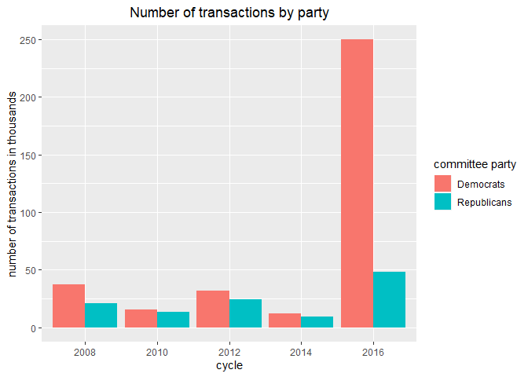<!-- -->

There are two observations we can derive from these three plots:

  - Scientists are more likely to give to Democrats in the 2016 cycle.
    This was also observed in the article of Fivethirtyeight.
  - The difference in spending behavior compared to the other cycles is
    much more happening for the donations made to Democrats. That is,
    the transaction amounts are much lower than before, but there are
    much more occurences of donations.

## Donation frequencies by amount category

In this section I examine several plots considering the transaction
amounts. It seems to make sense that there is an increase in small
donations in the 2016 cycle, and that this is happening more for the
Democrats. Let’s categorize the transactions into amount categories and
generate some plots.

``` r
data <- data %>%
  mutate(transaction_amt_cat = cut(transaction_amt, breaks=c(0,250,1000,100000, Inf), right=FALSE), # compute transaction amount bins
         )
```

``` r
data %>%
  group_by(cycle, transaction_amt_cat) %>%
  summarise(freq=n()/1000) %>%
  ggplot(aes(x=cycle, y=freq, fill=transaction_amt_cat)) +
  geom_bar(position="dodge", stat="Identity") +
  labs(title="Number of transactions by amount category", x="cycle", y="number of transactions in thousands", fill="transaction amount category") +
  theme(plot.title = element_text(hjust = 0.5))
```

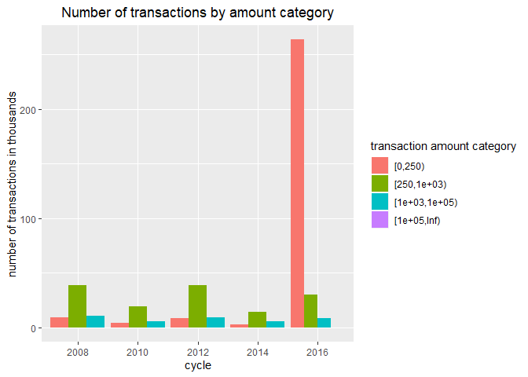<!-- -->

As can be seen from the plot above, most of the action occurs for the
smaller donations. Let’s create a more detailed time plot.

``` r
data %>%
  group_by(transaction_amt_cat, transaction_yearmonth) %>%
  summarise(freq=n()) %>%
  ggplot(aes(x=transaction_yearmonth, y=freq, color=transaction_amt_cat)) +
  geom_line() +
  labs(title="Number of monthly transactions by amount category", x="cycle", y="number of monthly transactions", color="transaction amount category") +
  theme(plot.title = element_text(hjust = 0.5))
```

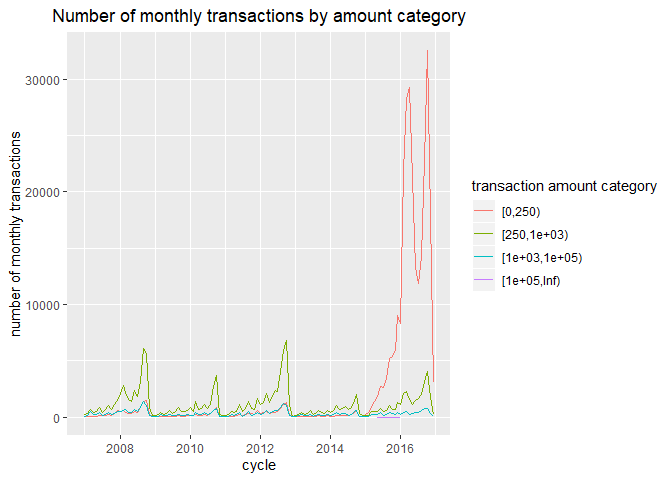<!-- -->

In the plot above we see a similar story: most of the actions occurs for
the smaller donations in the 2016 cycle. We expect to see this primarly
to happen for Democrats. Let’s find out:

``` r
data %>%
  filter(committee_party=="Democrats"|committee_party=="Republicans") %>%
  group_by(committee_party, cycle, transaction_amt_cat) %>%
  summarise(freq=n()/1000) %>%
  ggplot(aes(x=cycle, y=freq, fill=transaction_amt_cat)) +
  geom_bar(position="dodge", stat="Identity") +
  facet_wrap(~committee_party) +
  labs(title="Number of monthly transactions by amount category", x="cycle", y="number of transactions in thousands", fill="transaction amount category") +
  theme(plot.title = element_text(hjust = 0.5))
```

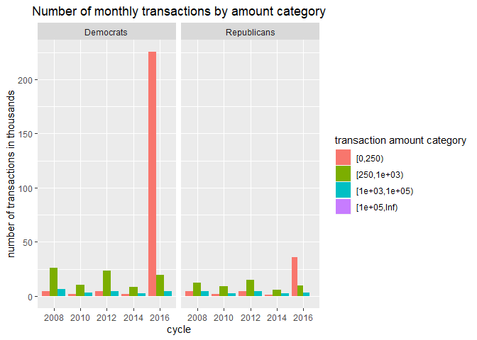<!-- -->

## The two spikes

What causes the two spikes in the 2016 election cycle? It appears that
this is partly due to the contributions to the presidential election
committees for the democrats. Let’s first plot the two spikes in small
amount contributions for the 2016 cycle for democratic committees.

Then let’s find out which committee type causes this pattern:

``` r
data %>%
  filter(cycle=="2016", committee_party=="Democrats", as.integer(transaction_amt_cat)==1) %>%
  group_by(transaction_yearmonth, cand_office) %>%
  summarise(freq=n()/1000) %>%
  ggplot(aes(x=transaction_yearmonth, y=freq)) +
  geom_line() +
  facet_wrap(~ cand_office, ncol=2) +
  labs(title="Number of monthly transactions by Democratic committee type", x="time", y="number of monthly transactions in thousands") +
  theme(plot.title = element_text(hjust = 0.5))
```

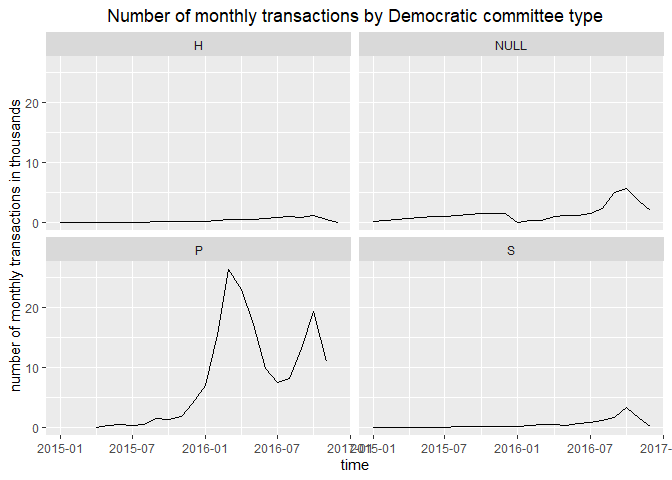<!-- -->

Let’s examine presidential committees in more detail:

``` r
data %>%
  filter(cycle=="2016", committee_party=="Democrats", cand_office=="P", as.integer(transaction_amt_cat)==1) %>%
  group_by(cmte_nm, transaction_yearmonth) %>%
  summarise(freq=n()) %>%
  ggplot(aes(x=transaction_yearmonth, y=freq, color=cmte_nm)) +
  geom_line() +
  labs(title="Number of monthly transactions by Democratic committee", x="time", y="number of monthly transactions", color="committee name") +
  theme(plot.title = element_text(hjust = 0.5))
```

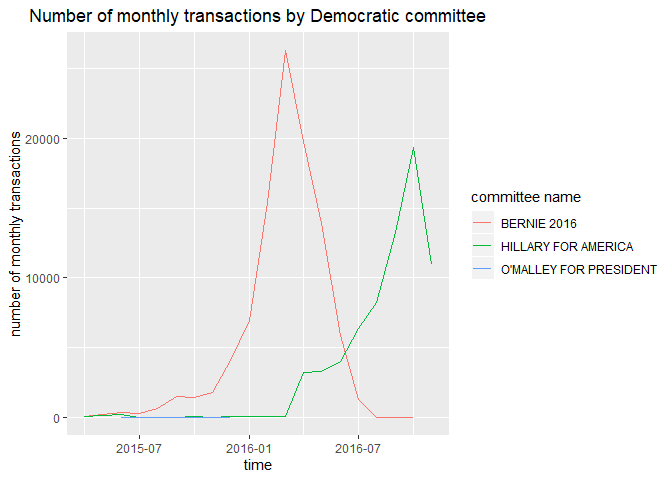<!-- -->

The spikes occur at identical spots. It seems that scientists first
favored Bernie.

## More unique individuals or more frequent contributors

What explains the increase in total number of transactions in the 2016
cycle? Are there more unique individuals contributing? Or do unique
individuals have more and smaller transactions? Let’s calculate the
following:

  - The number of unique individuals per election cycle
  - The mean number of transactions per individual per election cycle
  - The minimum, maximum and several percentiles of the number of
    transactions per individual per election cycle

<!-- end list -->

``` r
data %>%
  group_by(cycle, cleaned_name) %>%
  summarise(number_transactions_per_individual = n(),
            total_amount_per_individual = sum(transaction_amt),
            mean_amount_per_individual = mean(transaction_amt)
            ) %>%
  group_by(cycle) %>%
  summarise(number_of_unique_individuals = n(),
            mean_number_transactions_per_individual = mean(number_transactions_per_individual),
            minimum = min(number_transactions_per_individual),
            q10 = quantile(number_transactions_per_individual, 0.05),
            q25 = quantile(number_transactions_per_individual, 0.25),
            median = median(number_transactions_per_individual),
            q75 = quantile(number_transactions_per_individual, 0.75),
            q90 = quantile(number_transactions_per_individual, 0.90),
            maximum = max(number_transactions_per_individual),
            mean_total_amount_per_individual = mean(total_amount_per_individual),
            mean_mean_amount_per_individual = mean(mean_amount_per_individual)
  )
```

    ## # A tibble: 5 x 12
    ##   cycle number_of_uniqu~ mean_number_tra~ minimum   q10   q25 median   q75
    ##   <chr>            <int>            <dbl>   <int> <dbl> <dbl>  <dbl> <dbl>
    ## 1 2008             35124             1.66       1     1     1      1     2
    ## 2 2010             17451             1.66       1     1     1      1     2
    ## 3 2012             32728             1.74       1     1     1      1     2
    ## 4 2014             12797             1.72       1     1     1      1     2
    ## 5 2016             53925             5.60       1     1     1      2     6
    ## # ... with 4 more variables: q90 <dbl>, maximum <int>,
    ## #   mean_total_amount_per_individual <dbl>,
    ## #   mean_mean_amount_per_individual <dbl>

From the table above, we can see that there are more unique invdividuals
that contribute relative to the previous Presidential election cycle
(2012). It also seems that unique individuals have substantial more
transactions in the 2016 cycle. So to answer the question of this
section, both scenarios seem to take place: more unique individuals
contributing and more donations per unique individual.

Because we need the number of transactions per individual for further
analyses, let’s add it to the dataset.

``` r
number_transactions_per_individual <- data %>%
  group_by(cycle, cleaned_name) %>%
  summarise(number_transactions_per_individual = n())

data <- data %>%
  inner_join(number_transactions_per_individual, by=c("cycle", "cleaned_name"))
```

Let’s see what type of individual contributer drives the enormous bump
in the number of small amount transactions in the 2016 cycle. Are these
the frequent contributors, or are they the non-frequent contributors?

``` r
data %>%
  filter(as.integer(transaction_amt_cat)==1, cycle==2016) %>%
  mutate(transaction_frequency_cat = cut(number_transactions_per_individual, breaks=c(0,1,2,3,6,Inf), right=FALSE)) %>%
  group_by(transaction_frequency_cat, transaction_yearmonth) %>%
  summarise(freq=n()) %>%
  ggplot(aes(x=transaction_yearmonth, y=freq, color=transaction_frequency_cat)) +
  geom_line() +
  labs(title="Number of monthly transactions by transaction frequency category", x="time", y="number of monthly transactions", color="transaction frequency category") +
  theme(plot.title = element_text(hjust = 0.5))
```

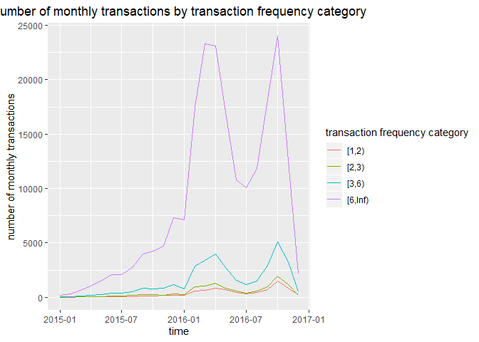<!-- -->

Indeed, as expected, the bump in the earlier figures is driven by the
donations of the frequent contributors.

## Multiple donations to the same committee or across committees

One of the explanations of why scientists have more frequent and smaller
donations is that they distribute their resources to multiple
committees. Let’s find out whether this occurs, or whether they are
distributing more frequently to the same committee.

``` r
data %>%
  group_by(cycle, cleaned_name, cmte_id) %>%
  summarise(number_per_cmt = n()) %>%
  group_by(cycle, cleaned_name) %>%
  summarise(number_unique_cmt_per_individual = n(),
            mean_number_per_cmt = mean(number_per_cmt)) %>%
  group_by(cycle) %>%
  summarise(mean_number_unique_cmt_per_individual = mean(number_unique_cmt_per_individual),
            mean_number_per_cmt = mean(mean_number_per_cmt)
            ) 
```

    ## # A tibble: 5 x 3
    ##   cycle mean_number_unique_cmt_per_individual mean_number_per_cmt
    ##   <chr>                                 <dbl>               <dbl>
    ## 1 2008                                   1.13                1.45
    ## 2 2010                                   1.18                1.39
    ## 3 2012                                   1.16                1.47
    ## 4 2014                                   1.18                1.42
    ## 5 2016                                   1.17                4.69

The first column displays the average amount of committees that an
individual contributor contributes to. In the 2016 cycle this is 1.166.
The distribution is similar as in in the 2012 cycle. When we look at the
mean number of committees individuals contribute this is large. Let us
plot the distribution for the 2012 cycle and for the 2016 cycle.

``` r
data %>%
  filter(cycle=="2012") %>%
  group_by(cleaned_name, cmte_id) %>%
  summarise(number_per_cmt = n()) %>%
  group_by(cleaned_name) %>%
  summarise(mean_number_per_cmt = mean(number_per_cmt)) %>%
  ggplot(aes(x=mean_number_per_cmt)) +
  geom_histogram(binwidth = 1) + 
  xlim(0,50) +
  labs(title="Histogram of mean number donations per committee for 2012 cycle", x="mean number of donations per committee", y="number of individuals") +
  theme(plot.title = element_text(hjust = 0.5))
```

    ## Warning: Removed 2 rows containing missing values (geom_bar).

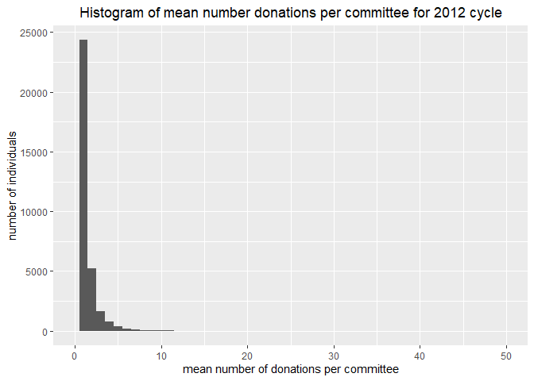<!-- -->

``` r
data %>%
  filter(cycle=="2016") %>%
  group_by(cleaned_name, cmte_id) %>%
  summarise(number_per_cmt = n()) %>%
  group_by(cleaned_name) %>%
  summarise(mean_number_per_cmt = mean(number_per_cmt)) %>%
  ggplot(aes(x=mean_number_per_cmt)) +
  geom_histogram(binwidth = 1) +
  xlim(0,50) +
  labs(title="Histogram of mean number donations per committee for 2016 cycle", x="mean number of donations per committee", y="number of individuals") +
  theme(plot.title = element_text(hjust = 0.5))
```

    ## Warning: Removed 203 rows containing non-finite values (stat_bin).

    ## Warning: Removed 2 rows containing missing values (geom_bar).

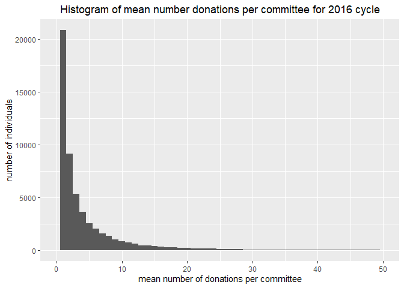<!-- -->

As you can see from the two figures, there are a lot more contributors
in 2016 compared to 2012 that contribute many donations to the same
committee.

## Bundled donations

The question then arises whether contributors with many amounts to the
same committee use different transaction dates. Or do they bundle
transactions on a particular date?

First, we examine how many bundled transactions are being
made:

``` r
# transactions that are double or tripple or more (transactions by individuals that occur for the same committee on same date)
data %>%
  group_by(cycle, cleaned_name, cmte_id, transaction_date) %>%
  summarise(n_samecmt_samedate = n()) %>%
  filter(n_samecmt_samedate >=2) %>%
  group_by(cycle) %>%
  summarise(number_of_bundled_transactions = n())
```

    ## # A tibble: 5 x 2
    ##   cycle number_of_bundled_transactions
    ##   <chr>                          <int>
    ## 1 2008                            1255
    ## 2 2010                             778
    ## 3 2012                             902
    ## 4 2014                             618
    ## 5 2016                           23718

There are in total 23718 transaction bundles that consists of two or
more transactions in the 2016 cycle. How many transactions are these?

``` r
data %>%
  group_by(cycle, cleaned_name, cmte_id, transaction_date) %>%
  summarise(n_samecmt_samedate = n()) %>%
  filter(n_samecmt_samedate >=2) %>%
  group_by(cycle) %>%
  summarise(total_number_transactions_within_bundle = sum(n_samecmt_samedate))
```

    ## # A tibble: 5 x 2
    ##   cycle total_number_transactions_within_bundle
    ##   <chr>                                   <int>
    ## 1 2008                                     2585
    ## 2 2010                                     1580
    ## 3 2012                                     1864
    ## 4 2014                                     1269
    ## 5 2016                                    53537

There are in total 53537 transactions that are bundled in the 2016
cycle, which is about 29 times as much as in the previous Presidential
election cycle. Another conclusion we can draw is that the average
number of transactions per bundle in the 2016 cycle is 2.26.So most of
the time, a bundle consists of 2 transactions.

To see what proportion of multiple transactions to the same committee is
bundled, let’s see how many transaction are done in total in case a
scientist contributes to the same committee multiple times:

``` r
data %>%
  group_by(cycle, cleaned_name, cmte_id) %>%
  summarise(number_transactions_per_committee = n()) %>%
  filter(number_transactions_per_committee >= 2) %>%
  group_by(cycle) %>%
  summarise(total_number_of_transactions = sum(number_transactions_per_committee))
```

    ## # A tibble: 5 x 2
    ##   cycle total_number_of_transactions
    ##   <chr>                        <int>
    ## 1 2008                         29064
    ## 2 2010                         13402
    ## 3 2012                         29058
    ## 4 2014                         10756
    ## 5 2016                        277266

This implies that about one-fifth of the multiple transactions done to
the same committee consists of a bundled transaction. The rest is done
on different dates.

## Transaction dates for multiple donations to the same committee

We saw that there are a lot of donations done by unique individuals to
the same committee. What is the amount of days between the transaction
dates for these donations? Let’s see how this varies with the number of
transactions per committee:

``` r
data %>%
  filter(cycle=="2016") %>%
  select(cleaned_name, cmte_id, transaction_date) %>%
  arrange(cleaned_name, cmte_id, transaction_date) %>%
  mutate(lag_cleaned_name = lag(cleaned_name),
         lag_cmte_id = lag(cmte_id),
         lag_transaction_date = lag(transaction_date)) %>%
  filter((cleaned_name==lag_cleaned_name & cmte_id==lag_cmte_id)) %>%
  filter(transaction_date!=lag_transaction_date) %>% # exclude bundled transactions
  mutate(ndays=transaction_date-lag_transaction_date) %>%
  group_by(cleaned_name, cmte_id) %>%
  summarise(mean_ndays = mean(ndays),
            number_cmt_transactions = n()) %>%
  mutate(number_cmt_transactions = number_cmt_transactions+1) %>%
  group_by(number_cmt_transactions) %>%
  summarise(mean_ndays=mean(mean_ndays)) %>%
  ggplot(aes(x=number_cmt_transactions, y=mean_ndays)) +
  geom_line() +
  xlim(0,80) +
  labs(title="Mean number of days between of unbundled transactions to same committee", x="number of transactions per committee", y="mean number of days") +
  theme(plot.title = element_text(hjust = 0.5))
```

    ## Don't know how to automatically pick scale for object of type difftime. Defaulting to continuous.

    ## Warning: Removed 23 rows containing missing values (geom_path).

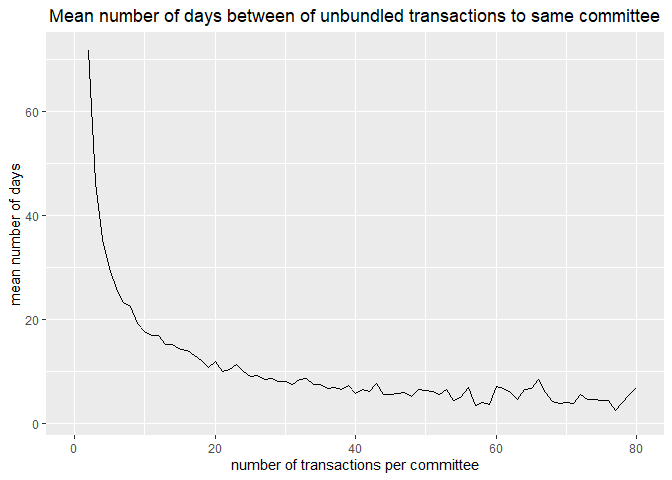<!-- -->

As you can see, as the number of transactions to the same committee
surpasses the 40 transactions, the mean time interval is about a week.
In case of a low number of donations to the same committee, the number
of days between the transactions can be quite high, up to one or two
months.

## Conclusion

In this project I found that the total amount of political donations
spent by scientists in the 2016 election cycle is of similar magnitude
in total as before, but the donation amount per individual is much lower
and the total number of donations is much higher. This is especcially
true for contributions to Democrats.

I explored more about this change in spending behavior of scientists. I
found that the number of individuals contributing in the 2016 election
cycle is higher, but also the number of transactions per individual
substantially increases compared to before. Scientists that have
multiple contributions seem to have increased their contributions to the
same committee, and not necessarily to multiple committees. About
one-fifth of the multiple transactions done to the same committee
consists of a bundled transaction. The rest is done on different dates.
If the contributions are done on different dates, then as the number of
transactions to the same committee surpasses the 40 transactions, the
mean time interval is about a week. In case of a low number of donations
to the same committee, the number of days between the transactions can
be quite high, up to one or two months.

The analysis reveals that scientists split their donations into multiple
parts, but tend to donate to the same committee. More analysis is needed
of why this is going on. It might be strategic behavior, that is,
scientists look at the polls and decide based on this to contribute more
or to stop contributing. But if this is an explanation, why doesn’t this
occur in prior election cycles? What’s new in 2016? Follow up analysis
could reveal more about the causes of the change in spending behavior.
This would definitely add to the story. Also, it would be interesting to
see whether this change in spending behavior does occur in other
occupation groups as well, and whether this pattern is seen throughout
the whole population. Finally, as already mentioned in the introduction,
it is important to rule out explanations for the behavior such as
threshold limits on political donations.
